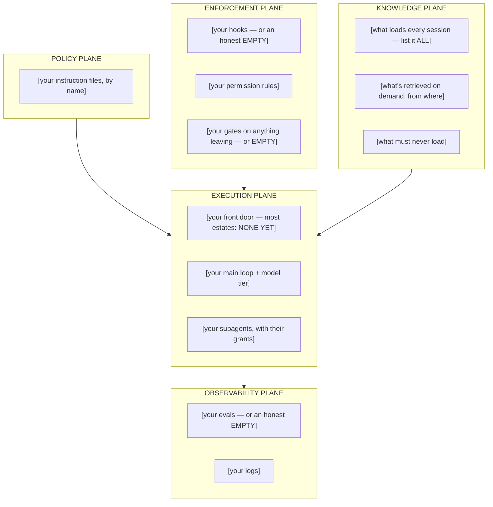

# Your estate map — the worksheet

This is the exercise the whole repo exists to set up. Fork the repo, then fill in this file for
the agentic deployment **you** actually run or are about to inherit — not the one you plan to
build. An estate map someone hands you is a generic picture; the one you draw is a design
document, and its blank spots are your gap analysis.

Full method, rules, and the one-minute narrative that goes with it:
[`guide/the-estate-map.md`](guide/the-estate-map.md).

## The rules

1. **Every bracket gets filled or marked `EMPTY` — in writing.** An `EMPTY` on the enforcement
   or observability plane is not a formatting problem; it's a finding.
2. **Draw what runs, not what you intend.** If your "review gate" is a sentence in an
   instruction file, it belongs on the *policy* plane. Where a control sits on this drawing is a
   factual claim.
3. **Expect three to five findings.** Typical first harvest: no front door, no gate on a whole
   class of outbound action, an unaudited always-resident set, retrieval entering untagged, zero
   evals. Each finding maps to a lesson and to a section of the
   [design brief](guide/11-the-design-brief.md).
4. **Date it and keep it.** Redraw quarterly or after any structural change; the diff between
   two maps is your architecture-level change history.

## The map — replace every bracket

## Findings

| # | Finding | Plane | Lesson | Design-brief section |
|---|---|---|---|---|
| 1 | | | | |
| 2 | | | | |
| 3 | | | | |

**Date drawn:** · **Estate:** · **Next redraw due:**
