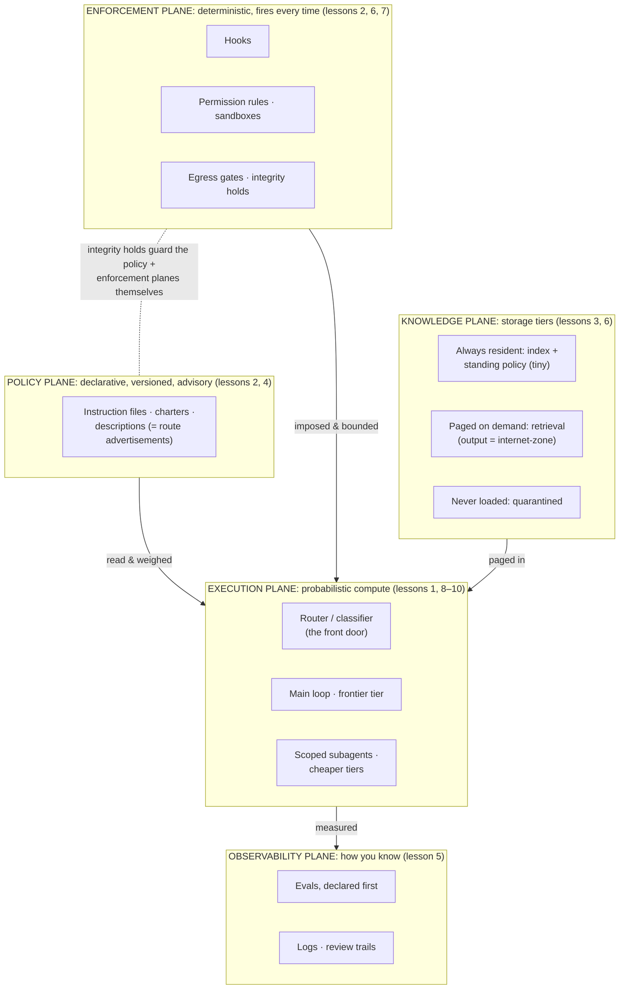

# The Agentic Estate

**A runnable template for people who run estates, not apps.**

Most agentic "starter kits" are piles of components: 135 agents, 40 hooks, copy what you like.
This repo is the opposite: a *minimal working estate* in which every file is a live instance of
one node on the map below, plus the field guide that teaches you to reason about it. You don't
copy this repo because it's comprehensive. You clone it because after an hour inside it you'll
understand any agentic deployment you're handed, including the one your employer is about to
hand you.

Built for infrastructure, network, and security operators: people whose career has been making
fleets of components they didn't write reliable. That skill is the job here too. Start with
[lesson 1](guide/01-the-estate-reframe.md) if you want the argument; start below if you want
your hands on the metal.

## The map: every agentic estate is five planes

Three reading rules make this the one truth:

1. **The planes are load-bearing.** Anything that must *always* happen lives in enforcement;
   anything the model *reads* lives in policy; anything *fetched* enters through knowledge with a
   zone tag. If you can't place a component on one plane, you don't yet understand the component.
2. **The arrows are the security model.** Policy is read; enforcement is imposed; knowledge is
   paged; everything is measured. The dashed arrow: the enforcement plane guards the very files
   the other planes are made of.
3. **The front door is drawn even when it doesn't exist.** This estate, like most, has no
   classifier, and every request lands straight on the main loop. The empty seat is a finding.

## Every file, placed on the map

| File | Plane | What it demonstrates |
|---|---|---|
| `CLAUDE.md` | Policy | A minimal instruction file, advisory by nature, and it says so |
| `.claude/agents/scout.md` | Policy + Execution | A scoped subagent; its `description` is a route advertisement (lesson 9), its `tools` line is least-grant |
| `.claude/settings.json` | Enforcement | Hook wiring + a `deny` rule that makes the quarantine real |
| `.claude/hooks/protect-policy.sh` | Enforcement | An integrity hold: the estate's policy files cannot be edited by the estate (lesson 7) |
| `knowledge/resident/INDEX.md` | Knowledge (resident) | The tiny always-loaded tier |
| `knowledge/paged/` | Knowledge (paged) | Retrieved-on-demand content, zone-tagged as data-not-instructions (lesson 6) |
| `knowledge/quarantine/` | Knowledge (never) | The never-load tier, enforced rather than just declared |
| `evals/EVALS.md` | Observability | Three evals, declared before you trust anything (lesson 5) |
| `ESTATE-MAP.md` | none | Your worksheet: the L2 exercise that audits *your* estate |
| `guide/` | none | The field guide: 11 lessons, the estate map, a drill sheet |

## Run it

1. Clone this repo and launch [Claude Code](https://claude.com/claude-code) inside it.
2. Run the three evals in [`evals/EVALS.md`](evals/EVALS.md): one proves the enforcement plane
   fires every time, one probes the policy plane's *statistical* compliance, one watches routing.
   The difference you observe between eval 1 and eval 2 is the entire discipline.
3. Then the real exercise: fork this repo and fill in [`ESTATE-MAP.md`](ESTATE-MAP.md) for the
   agentic deployment you actually run (or are about to inherit). Every bracket gets filled or
   marked `EMPTY`, in writing. The blanks are your gap analysis, and a typical first harvest
   is three to five findings, and each maps to a lesson and to a section of the
   [design brief](guide/11-the-design-brief.md).

## The field guide

| # | Lesson | | # | Lesson |
|---|---|---|---|---|
| 1 | [The estate reframe](guide/01-the-estate-reframe.md) | | 7 | [Management-plane integrity](guide/07-management-plane-integrity.md) |
| 2 | [Probabilistic components](guide/02-probabilistic-components.md) | | 8 | [Classification, then forwarding](guide/08-classification-then-forwarding.md) |
| 3 | [Context is attention](guide/03-context-is-attention.md) | | 9 | [Route advertisements](guide/09-route-advertisements.md) |
| 4 | [Prompt as interface](guide/04-prompt-as-interface.md) | | 10 | [Silent misroutes & the default route](guide/10-silent-misroutes-and-the-default-route.md) |
| 5 | [Evals](guide/05-evals.md) | | 11 | [The design brief (capstone)](guide/11-the-design-brief.md) |
| 6 | [Trust boundaries & injection](guide/06-trust-boundaries-and-injection.md) | | | Plus: [the estate map](guide/the-estate-map.md) · [drill sheet](guide/drill-sheet.md) · [names to know](guide/names-to-know.md) |

---

*A [Chorusse](https://chorusse.com) field guide. The generic instance is free and complete.
Domain-specific instances and estate design engagements are how the lights stay on.*
