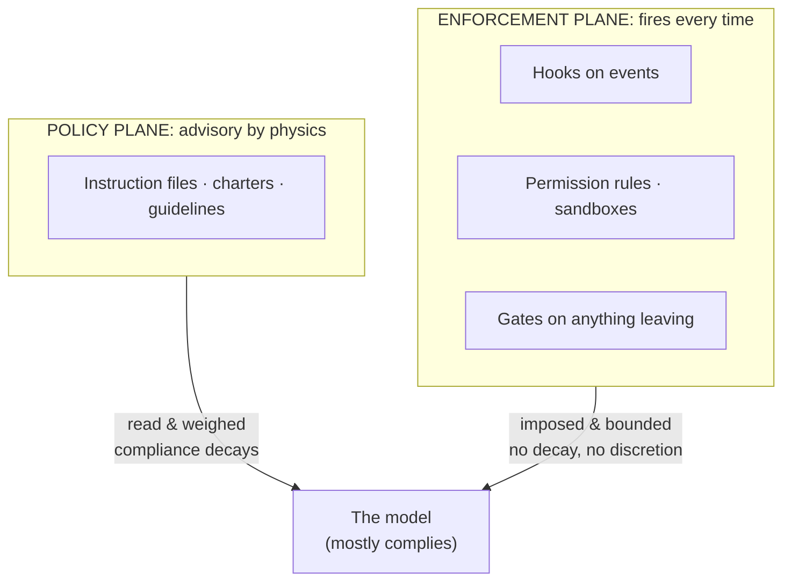

# Lesson 2 — Probabilistic components (and the two planes)

*Agentics field guide, lesson 2 of 11. Prerequisite: lesson 1. This lesson absorbs the
policy-plane-vs-enforcement-plane concept — same mechanism, seen from the design side.*

## Start where you live

A cron job runs or it doesn't. If it doesn't, something findable is wrong — the daemon, the
crontab, the permissions — and once fixed, it runs every time again. Your whole operational
worldview rests on parts like this: *configured means enforced.* You write `deny` in an ACL and
the packet is denied, not "usually denied," not "denied while the router is feeling focused."

## The mechanism: what "mostly complies" actually is

A language model produces each word by sampling from a probability distribution shaped by
everything currently in its context — your instructions, the conversation, retrieved documents,
all of it competing for influence. An instruction is not an opcode; it's one voice in a weighted
chorus. That has three consequences you can reason about like an engineer:

1. **Compliance is statistical.** A clear instruction in an uncrowded context wins almost every
   time. The same instruction in a crowded context wins less often. Nothing "breaks" in between —
   the odds just shift.
2. **Compliance decays as context fills.** Early instructions sit farther from the model's
   attention as the session grows. The policy file it read at startup is still *there*; it just
   competes with fifty thousand newer words. Long sessions don't crash — they drift.
3. **Failure is fluent.** When a deterministic part fails, you get an error. When a probabilistic
   part fails, you get a confident, well-formatted answer that happens to ignore your rule. No
   stack trace. No alert. The output *looks like success.*

None of this is a defect to be patched out. It's the physics of the material, the way packet loss
is the physics of networks. You didn't fix packet loss with sterner cables; you designed TCP
around it. Same move here.

## Spring the break: the two planes

So here is the design response, and it's the single most load-bearing split in the whole estate:

**Anything that must ALWAYS happen cannot live in prose.**

Sort every control you have into two planes:

- **The policy plane** — written intent the model reads: instruction files, charters, guidelines.
  Declarative, versioned, cheap to change. *Advisory by physics.* This is your written security
  policy: it shapes behavior, it does not guarantee it.
- **The enforcement plane** — mechanisms that fire regardless of what any model feels like doing:
  hooks on events, permission rules, sandboxes, gates on outbound actions. Deterministic. *This is
  your firewall.* A hook is a cron job again — it runs or it doesn't, and you can trust it the old
  way.

In your old estate, the config *was* the enforcement — one plane, because the parts were
deterministic. Here they're two planes, and **confusing them is the root estate-design error**:
writing "never push without review" in an instruction file and believing the estate now has change
control. It has a *request* for change control. The estate has change control when a mechanism
holds the push.

The design procedure falls out directly. For every rule you care about, ask: *what happens if the
model ignores this at the worst moment?* If the answer is "annoying," the policy plane is fine —
it's cheap and it works most of the time. If the answer is "data leaves the building" or "the
demo dies," the rule must be re-homed to the enforcement plane, and the prose version becomes
documentation of what the mechanism enforces.

## What you'd say in the room

> "The model is a probabilistic component — instructions are advisory and compliance decays as
> context fills. So we run two planes: prose states policy, mechanisms enforce it. Anything that
> must always happen — egress control, review gates, audit logging — lives in a hook or a
> permission rule, never in a paragraph. If your only control is a sentence, you don't have a
> control."

## The bridge to your own deployment

Audit your setup with one question per control: *prose or mechanism?* List every rule you've
written into an instruction file, and mark the ones whose failure you couldn't tolerate. Every
mark is a migration ticket to the enforcement plane. Most teams find the same three first: nothing
actually prevents an outbound action, nothing actually forces a review before a destructive step,
and their most important rule lives in their prettiest paragraph. You've run this exact audit
before — it's the one where you check which security policies have a technical control behind them
and which are laminated wishes on the breakroom wall.

## The rows, handed back

**Probabilistic components — teach:** an agent is a component that mostly complies; prose policy is
advisory and compliance decays as context fills. **Bite:** there is no "configured = enforced" —
anything that must always happen has to live in a deterministic mechanism.

**Policy vs enforcement plane — teach:** prose states intent, mechanism guarantees it. **Bite:** in
your old estate config *was* enforcement; here they're different planes, and confusing them is the
root design error.

One sentence each when you started; now they're the same mechanism seen from two sides — the
physics, and the design answer to the physics.
