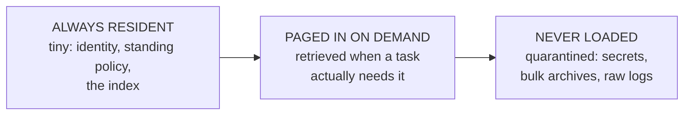

# Lesson 3 — Context is attention, not space

*Agentics field guide, lesson 3 of 11. Prerequisite: lesson 1. Feeds the loading-map one-liner
(row 9) and every capacity decision in the guide.*

## Start where you live

You've sized memory for twenty years. The rules were stable: RAM is scarce and fast, disk is
cheap and slow, and the failure mode of scarcity is obvious — swapping, thrashing, OOM kills. But
one rule sat so deep you never said it aloud: **unused capacity is harmless.** Nobody ever
degraded a server by installing more RAM than it needed. Filling half of it with a cache "just in
case" cost you nothing but the DIMMs. Headroom was free.

The model's context window looks exactly like RAM — a scarce, fast working set, with your
knowledge base as the cheap slow tier behind it. The mapping is real and you should use it. But it
smuggles in that unspoken rule, and here the rule is false.

## The mechanism: why more loaded = worse output

Every token in the context window participates in generating every new token. The model doesn't
have a free "ignore" operation — attention is a budget spread across everything present. Load a
document and it isn't stored, it's *attended to*, forever competing with your actual question for
the model's focus. Three engineering consequences:

1. **Irrelevant content is active interference, not idle occupancy.** A loaded-but-irrelevant
   document is not a cold cache page; it's a noisy neighbor. It pulls word choices, biases
   reasoning toward its topic, and dilutes the weight of the instructions that matter. The
   degradation is gradual and silent — quality sags, it doesn't crash.
2. **Signal-to-noise is the real capacity metric.** Two sessions with identical token counts can
   perform completely differently depending on what the tokens *are*. The question is never "does
   it fit?" — it's "does everything present deserve attention?" You're not managing space; you're
   managing a signal path.
3. **The cost is quadratic-ish socially even when it's linear technically.** Every marginal
   document you load taxes every subsequent exchange in the session. Load early, pay always.

So the memory-manager's mental model needs one amendment: this RAM *leaks meaning*. What you page
in shapes what comes out, whether or not it was relevant.

## Spring the break

**Unused RAM is harmless; irrelevant context actively degrades quality.** That's the difference
that bites, and it inverts a lifetime of instinct. "Load everything to be safe" — the instinct
that never once hurt you in server sizing — is here the *unsafe* choice. Safety and minimalism
have switched sides.

This is why the estate needs a **loading map** (the one-liner you already own from the anchor
map): a deliberate, tiered decision about knowledge —

— where the design pressure is *downward*. Every candidate for "always resident" must justify its
permanent attention tax. The index earns its seat because it's small and it's how everything else
gets found. That eight-page style guide does not; it moves to on-demand. The archive never loads
at all — a pointer loads, and the content is fetched if and only if a task names it.

Note what the loading map really is now: not a cost plan (though it saves money), but a
**signal-to-noise plan**. You are provisioning attention.

## What you'd say in the room

> "Context isn't storage, it's attention — everything loaded competes for focus on every
> subsequent step. So we keep the resident set tiny, page knowledge in on demand through an index,
> and treat 'load it all to be safe' as the risk, not the mitigation. We provision signal, not
> space."

## The bridge to your own deployment

Pull up whatever your assistant loads at session start and cost it honestly, line by line:
*does this earn permanent attention, or is it here because loading felt safer than deciding?*
Then watch one long working session and notice where quality sagged — instructions from the first
hour getting missed in the third, answers drifting toward whatever large document entered at
midday. You've seen this failure shape before: it's the monitoring dashboard with forty panels
where the one that matters goes unread. Same physics, same fix — curate ruthlessly, and make
"what's on the glass" a design decision instead of an accumulation.

## The row, handed back

**Teach:** context is the scarce resource like RAM — but loading more can make output worse.
**Bite:** unused RAM is harmless; irrelevant context actively degrades quality, so the loading map
is a signal-to-noise plan, not just a cost plan.

The anchor still holds — it *is* a memory hierarchy. You now know the one clause the anchor gets
wrong, and it's the clause every loading decision turns on.
