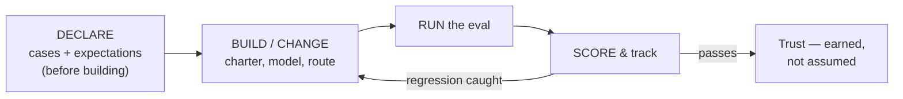

# Lesson 5 — Evals

*Agentics field guide, lesson 5 of 11. Prerequisite: lesson 2. Deliberately placed before the
routing lessons — the classifier's eval (lesson 10) leans on this one.*

## Start where you live

You never trusted a system because it was built well. You trusted it because it was *measured*:
monitoring on every service, SLOs with numbers attached, and — for the things that really
mattered — fire drills. The backup that isn't test-restored is not a backup; you learned that
early, probably the hard way. Green dashboards, alert thresholds, restore tests, failover drills:
your entire notion of "reliable" was operational, continuous, and empirical.

Bring exactly that posture. An **eval** is monitoring plus the fire drill, applied to a
probabilistic component.

## The mechanism: what an eval is, concretely

An eval is a fixed set of test inputs with known-good expectations, run against a part of your
estate, producing a score you can track over time. That's it — it's a synthetic-transaction
monitor for behavior. Building one has the same anatomy as building a good check ever did:

1. **Collect real cases.** A dozen to a few hundred actual inputs from your estate's real traffic
   — real requests, real documents, real edge cases. Synthetic-only test sets measure your
   imagination, not your system; you learned this writing monitoring checks that never fired on
   real incidents.
2. **Declare expectations per case.** What should the output contain, do, or never do? Some
   expectations are mechanical (the answer names the right file; the forbidden action is absent),
   some need a judgment call — which can itself be delegated to a model *grading against your
   written rubric*, the way a senior engineer grades a junior's runbook execution.
3. **Score, and re-run on a schedule and on every change.** New model version, edited charter,
   new retrieval source — each is a change window, and the eval is the verification step you
   never skipped in a network change either.

The word sounds grander than the artifact. A twenty-case eval in a script is not a research
project; it's a smoke test, and it beats zero cases by roughly the same margin that any
monitoring beats no monitoring.

## Spring the break

In your old estate, failure announced itself: services crash, links drop, disks fill, pagers
fire. The monitoring you built was partly *confirmation* of failures that were already loud.
Here — as lesson 2 established — **failure is fluent.** A degraded agent doesn't crash; it
produces confident, well-formatted, slightly-wrong output, indefinitely, and nothing pages.

So the break: **without a declared eval, failure is invisible — therefore the eval is written
*before* the thing it measures.** Not after, as documentation of what you built. Before, as the
definition of what "working" means. If you can't write the eval — can't produce ten real inputs
and say what good output looks like — you don't yet know what you're building, and the model
will resolve that ambiguity for you (lesson 4 told you how it resolves ambiguity).

This inverts the comfortable order. You built systems first and instrumented them second, because
a broken build announced itself during commissioning. Here, commissioning proves nothing: the
demo always works. The eval is the only commissioning that counts.

## What you'd say in the room

> "We don't trust any agentic component because it was built carefully — we trust it because it's
> continuously measured. Every piece has an eval: real cases, declared expectations, re-run on
> every change and on a schedule, like a change-window verification plan. And the eval gets
> written before the component, because with probabilistic parts a failure never announces
> itself — if we haven't defined 'working,' we can't see 'broken.'"

## The bridge to your own deployment

Pick the one agentic behavior you currently depend on most and give it a ten-case eval this week:
ten real inputs from your own history, one line of expectation each, a script that runs them and
counts. Then put it where your other checks live — scheduled, with the score tracked. The first
run will teach you something (it nearly always does — usually that one "reliable" behavior passes
seven of ten). More importantly, you'll have converted trust-by-vibes into trust-by-measurement
for one component, and the pattern replicates: every future lesson in this guide that ends with
"...and it ships with an eval" now points at something you've built.

## The row, handed back

**Teach:** you don't trust a system because it was built well; you trust it because it's
continuously measured. **Bite:** there is no green/red dashboard for free — without a declared
eval, failure is fluent and invisible, so the eval is written *before* the thing it measures.

Monitoring was always your religion. This is the same religion; the only change is that here,
the silent failure mode isn't the exception — it's the default.
