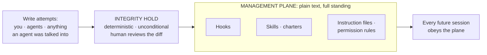

# Lesson 7. Management-plane integrity

*Agentics field guide, lesson 7 of 11. Prerequisites: lesson 6, plus the hooks and skills
one-liners (rows 11 and 16). The shortest path from telecom's hardest recent lesson to your
estate.*

## Start where you live

The defining telecom compromise of this decade didn't attack the radio, the user plane, or the
crypto. Salt Typhoon went through the *management* of the networks: the administrative systems,
the lawful-intercept infrastructure, the places where operators control the network. It worked
because whoever holds the management plane holds everything, silently, with legitimate-looking
hands. Every hardened estate you've run internalized this: the jump boxes, the config
repositories, the firmware chain, the admin credentials. That layer outranks the whole data
plane, because the data plane *obeys* it.

So: locate the management plane of an agentic estate. It's not the model, because you can't
reconfigure the model. It's the layer that controls what the model does, every session,
deterministically or near-deterministically. Look at what that actually is:

**Hooks. Skills. Instruction files. Permission rules.** The enforcement plane and the policy
plane, the very controls lessons 2 and 6 taught you to rely on, *are* the management plane of
this estate.

## The mechanism: why this plane is uniquely soft here

Now inventory the plane's substance, and feel your old instincts flinch:

1. **It's plain text in a repository.** The hooks are scripts; the skills and charters are
   markdown files; the permission config is JSON. No signed firmware, no TPM, no vendor
   attestation chain. `chmod` and file ownership are frequently the entire integrity story.
2. **It executes with full standing.** A hook fires on every event with real system access. A
   skill is pulled into context and *followed*; it's policy-plane text with runbook authority.
   An edited instruction file is simply the new policy, no questions asked, next session onward.
3. **The actors it governs can often write to it.** This is the part with no precedent in your
   old estate: the workloads can frequently edit the management plane that governs them. An agent
   with file access and a writable config directory is a router that can rewrite its own boot
   config, and lesson 6 showed that outside text can steer an agent. Chain those: a hostile
   document persuades an agent; the agent edits a hook or a charter; the edit governs every
   *future* session. That's an injection promoted to a **persistent implant**, the transient
   attack become resident, exactly the escalation your old world called "they're in the
   firmware now."

That third point is the one to sit with. In the telecom case, the attacker had to breach the
management systems from outside. Here, the estate's own components are standing inside the
management plane's write path, one persuasive document away from being someone's hands.

## Spring the break, and the controls

**The management plane is plain markdown in a repo agents can write to, so integrity holds on
those paths are the whole game, not paranoia.** The control set is your firmware-and-config
discipline, translated:

- **Restrict the write path.** Hooks, skills, charters, and permission files get the tightest
  ownership the platform allows, ideally not writable by the identities that run day-to-day
  work. Where the platform can't fully separate, the next control catches the gap.
- **Hold every change for human review.** Any diff touching a management-plane path is held
  before it propagates, by a deterministic gate (lesson 2: enforcement plane, not a polite request)
  that treats a hook edit like a firmware update: reviewed, or it doesn't ship. A tampered hook
  and a well-intentioned bad hook edit are, from the estate's perspective, the same event,
  which is why the hold is unconditional rather than intent-based.
- **Keep the plane in version control and diff it.** Text is the weakness and the gift: unlike
  firmware, your management plane diffs perfectly. Every change is reviewable line by line, and
  an unexpected diff on this plane is your highest-severity alert. It's the estate's equivalent
  of "the running config doesn't match the saved config, and nobody filed a change."

## What you'd say in the room

> "In an agentic estate the hooks, skills, and instruction files are the management plane. They
> govern every session, and they're plain text. Tampering with them isn't a config change, it's
> estate compromise, and the nasty path is an injected agent editing its own governance into a
> persistent implant. So those paths get firmware treatment: restricted writes, an unconditional
> hold-for-review on every diff, and version control as the attestation chain. Salt Typhoon's
> lesson, one material over: the compromise vector is the management of the system, not the
> system."

## The bridge to your own deployment

List every file that shapes agent behavior in your setup: hooks, skills, charters, instruction
and permission files. For each, answer two questions: *who can write it?* and *what reviews a
change before it takes effect?* Anywhere the answers are "the agents themselves" and "nothing,"
you've found an unlocked management plane, the equivalent of world-writable firmware. The fix is
a day's work: tighten ownership where you can, and wire a hold that pauses any change on those
paths until a human has read the diff. It will fire on your own legitimate edits too. Good. So
did change control.

## The row, handed back

**Teach:** hooks, skills, and instruction files ARE the estate's management plane; tampering with
them is estate compromise. **Bite:** that plane is plain markdown in a repo agents can write to,
so integrity holds on those paths are the whole game, not paranoia.

That closes the trust arc. Next comes the routing arc, starting with the one difference between your
routing and this routing that everything else falls out of.
