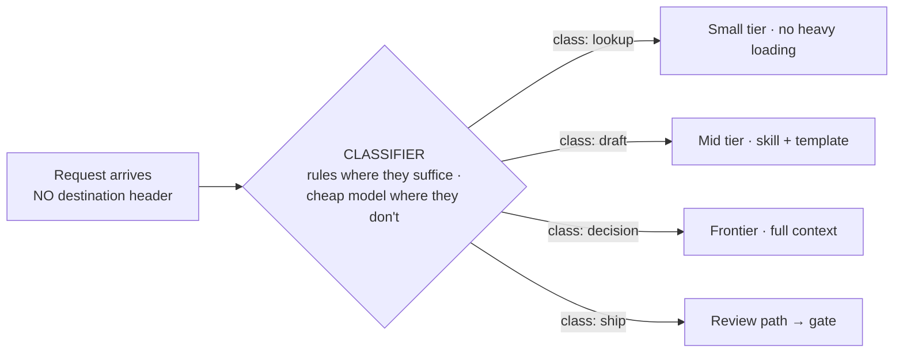

# Lesson 8. Classification-then-forwarding (and its economics)

*Agentics field guide, lesson 8 of 11. Prerequisites: lessons 1–2. Opens the routing arc. This
lesson absorbs classification economics, because the cost model is half of the same idea.*

## Start where you live

Routing, on the wire, is a *lookup*. The packet arrives carrying its destination in the header;
the router's entire job is picking the best path to an address the traffic itself declares.
Longest-prefix match, wire speed, done. It's so fast and so mechanical that you've probably never
thought of "deciding where traffic goes" as expensive, since reading the header is free by
construction.

But your world also contains another kind of routing, and you never called it routing: the L7
load balancer steering on URL paths, the DPI box classifying flows by payload, the mail room, the
helpdesk triage desk reading tickets to decide which queue gets them. In all of those, the
traffic *doesn't say* where it's going, so something has to read the content and infer.

Hold that second family in mind. It's the only one that exists here.

## The mechanism: no header, so classify first

**A packet carries its destination; a prompt doesn't.** A request arriving in an agentic estate
("summarize this," "fix the build," "should we ship?") names no handler, no skill, no model tier.
Where it should go must be inferred *from the payload*. So agentic routing is never plain
forwarding; it is always two stages:

1. **Classify.** Read the request and assign it a class from your taxonomy: lookup, draft,
   decision, shipping-grade change, whatever your traffic actually contains.
2. **Forward.** Map the class to a handler: which skill, which agent, which model tier, which
   budget.

Stage 2 is your old routing table: class in, path out, auditable. All the novelty concentrates
in stage 1, and it has a property your L3 instincts will keep forgetting: **the classifier is
itself a fallible component with an accuracy number.** Your routing table never guessed. This one
does; lesson 10 is about what happens when it guesses wrong.

## Spring the break: classification costs money now

Here's the economic inversion, folded into this lesson because it's the same thought completed:
**on the wire, classification is free, a header read at wire speed. Here, classification costs
a model call.** Reading the payload and inferring intent is model work, and if you're not
careful, expensive model work.

So a new craft appears that never needed to exist on the wire: **build the cheapest classifier
that is accurate enough.** The ladder, from free to unjustifiable:

- **Rules.** Regex, keywords, path patterns. Free, instant, deterministic. Correct for any class
  with a reliable surface signature ("starts with a URL," "mentions a ticket number").
- **A small, fast model.** The cheap tier reading the first lines and returning one label as
  JSON. Pennies, fast, and accurate enough for most taxonomies. This is the workhorse.
- **A frontier model.** Reading the whole request to decide where it goes. Almost never
  justified, and there's a name for the anti-pattern by analogy: **running your core router as
  the receptionist.** Spending big iron on triage is capacity mismanagement you'd never tolerate
  in a datacenter. The instinct "use the best model to decide" is precisely backwards, because
  the decision is the cheapest step and the handling is the expensive one.

And one consequence worth pricing in now: an estate with *no* designed routing hasn't escaped
these costs; it has silently chosen the worst row of the table. Every request, including trivial
lookups, lands on the most expensive handler with full context. That's a network with an empty
routing table and a default route pointed at the core: it works, the way a flat network with one
big router works, and it's the first thing an architect fixes.

## What you'd say in the room

> "Agentic routing is classification then forwarding. Requests carry no destination, so
> something must read the payload and infer the class before any table applies. The classifier is
> a fallible component with an accuracy number, and unlike header lookups it costs money, so the
> craft is the cheapest classifier that's accurate enough: rules where they suffice, a small
> model where they don't, and never the frontier model just to decide where something goes."

## The bridge to your own deployment

Log a week of your own requests, every ask you hand your assistant, and hand-label them into
classes. This is your traffic matrix, and it's the founding artifact of the whole routing arc
(lessons 9 and 10 both build on it). Most people find their taxonomy is small, with four to seven
classes covering ninety-plus percent, and that a majority of traffic is cheap lookups currently
transiting the most expensive path that exists. You've done this exact exercise before: it's a
traffic study before a network redesign, and it ends the same way, with the shape of the demand,
on paper, before anyone touches the equipment.

## The rows, handed back

**Classification-then-forwarding.** *Teach:* a packet carries its destination; a prompt doesn't, so
routing here is classify-then-forward: your L7 content routing, not your L3 table. **Bite:**
classification isn't wire-speed-free. It costs a model call, so the craft is the cheapest
classifier that's accurate enough.

**Classification economics.** *Teach:* rules free, small models cheap, frontier triage is your
core router working reception. **Bite:** "use the best model to route" is precisely backwards.

Next: where the routing table's entries actually live, and why you've been writing route
advertisements without knowing it.
