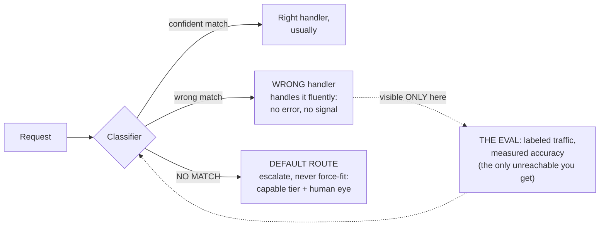

# Lesson 10. Silent misroutes and the default route

*Agentics field guide, lesson 10 of 11. Prerequisites: lessons 5 and 8. Closes the routing arc.*

## Start where you live

On the wire, bad routing is *loud*. A packet with nowhere to go gets dropped and ICMP tells the
sender `unreachable`. A loop burns TTL and announces itself. A misconfigured route black-holes
traffic and within minutes something upstream is retransmitting, alarming, or paging. The
network's failure modes are rude, and their rudeness is a gift you've been living on your whole
career: **on the wire, failure signals.** Your monitoring, your troubleshooting reflexes, your
sleep, all of it leans on misrouted traffic making noise.

And the default route completes the picture: `0.0.0.0/0`, the humble last row, catching whatever
matched nothing more specific. Unglamorous, mandatory, and safe: worst case, traffic takes a
suboptimal path and *still gets somewhere real*.

Both of those comforts are about to invert.

## The mechanism: how misdelivery behaves without an unreachable

Run lesson 8's machinery forward into failure. The classifier, a fallible component with an
accuracy number, assigns the wrong class, or the advertisements (lesson 9) steer a request to
the wrong handler. What happens next?

**The wrong handler handles it.** Fluently. A shipping-grade change classified as a quick answer
gets a quick answer: confident, well-formatted, unreviewed. Nothing errors, because nothing *is*
erroring by any component's local definition: the classifier returned a label, the handler
handled, the user got prose. There is no ICMP in this stack. No component knows the request
belonged elsewhere, so no component can signal it. **Misroutes are silent and fluent**, lesson
2's failure signature, now at the layer that decides everything downstream.

And the no-match case is worse than silent; it's *actively wrong*. A classifier built on "pick
the best class" does exactly that when confronted with traffic from outside its taxonomy: it
picks the best class. The genuinely novel request, the one your taxonomy never imagined, gets
**force-fitted into its nearest known class** and handled by machinery built for something else.
Contrast that with the wire: a packet matching no route gets dropped *and reported*. Force-fit
is a default route that quietly rewrites the destination address to somewhere it already knows.
No network you've ever run would tolerate the concept.

## Spring the break: the two design rules

**There is no unreachable here, so you must build its replacement, twice.**

1. **Every table ends with an explicit escalate-don't-guess row.** The classifier must have a
   real output for "none of the above": not the nearest class, but a distinct no-match class
   whose handler is the escalation path: the capable tier plus a human eye, or at minimum a
   flagged, logged, please-look-at-this lane. The default route survives translation, but its
   character flips: on the wire it was *any port in a storm, deliver anyway*; here it's the
   opposite. **When unsure, stop guessing.** Delivery-at-all-costs is the bug now, because
   wrong-handler delivery looks exactly like success. (You wired the same clause into your
   charters in lesson 4, "when unsure, ask," and this is that clause at the routing layer, as
   mechanism instead of prose.)
2. **The classifier ships with its eval, or the table is fiction.** With no failure signal
   anywhere in the path, measurement is the *only* way misroutes become visible. There is
   nothing else; no dashboard lights up on its own. So lesson 5's discipline is mandatory at
   this layer: hold back your hand-labeled traffic matrix (lesson 8), run it against the
   classifier, and get the accuracy number and, more useful, the confusion pattern: *which*
   classes bleed into which. A route change on the wire shipped with a verification plan; a
   taxonomy change, new advertisement, or classifier swap ships with a re-run of this eval.
   Same discipline, same reason, higher stakes.

## What you'd say in the room

> "On the wire, misrouted traffic announces itself; here, misroutes are silent and fluent. The
> wrong handler happily answers, and a no-match doesn't drop, it force-fits into the nearest
> class. So two rules are non-negotiable: every routing table ends with an explicit
> escalate-don't-guess default, and the classifier ships with an eval on labeled real traffic,
> because measurement is the only failure signal this stack will ever give us."

## The bridge to your own deployment

Ask two questions of whatever routing your estate does today, designed or accreted. *Where does
the unknown go?* If you can't point at an explicit no-match lane, then somewhere your estate is
force-fitting novel requests into familiar machinery, and you just haven't seen it, which is the
point. *And how would you know?* If nothing measures classification against labeled truth, your
answer is "I wouldn't," out loud, in those words. Then fix both in one sitting: add the
escalation row first (it's one rule and one handler), and stand up the eval from the traffic
matrix you built in lesson 8. Those two artifacts, the default route and the measured table,
are what separates routing you designed from routing that merely happened.

## The row, handed back

**Teach:** there is no unreachable. A misrouted request gets answered fluently by the wrong
handler, and no-match gets force-fitted into the nearest class. **Bite:** so every table ends
with an explicit escalate-don't-guess default, and every classifier ships with its eval the way
a route change ships with verification.

The arcs are complete: trust, routing, and the planes beneath them. One lesson remains, the one
all twenty-eight rows have been prerequisites *for*.
