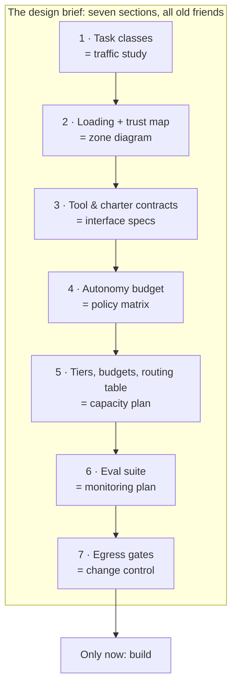

# Lesson 11. The design brief (capstone)

*Agentics field guide, lesson 11 of 11, the target the whole chain climbs to: design the estate
on paper first.*

## Start where you live

You never built a serious network by plugging things in and seeing what happened. Somebody handed
you (or you wrote) the design questionnaire: what traffic, what volumes, what zones, what SLAs,
what growth. Then came the diagrams, the policy matrix, the capacity plan, and only then the
purchase orders and the cabling. The discipline had a shape: **requirements → design → build**,
with the design artifacts doing the arguing while arguing was still cheap.

Agentic estates, almost everywhere, get built the other way: a tool installed, an assistant
tried, a hook added after the first scare, a subagent bolted on: accretion, then wonder at the
sprawl. Not because the builders are careless, but because the material is new enough that nobody
handed them the questionnaire. This lesson is the questionnaire. And every row of it is a
document you have written before, for networks. Only the material changed.

## The mechanism: the brief, section by section

Each section below pairs the network-design artifact you know with its estate translation, and
every one is a lesson you've now had:

1. **Traffic study → task-class inventory** *(lesson 8).* What work actually arrives? Real
   requests, hand-labeled into classes, with volumes. The founding artifact; every later section
   keys off these classes. Get it from a logged week, never from imagination.
2. **Zone diagram → loading and trust map** *(lessons 3 and 6).* What knowledge exists, and for
   each: always resident, paged on demand, or never loaded, and trusted or internet-zone? One
   drawing answers both, because they're both "what gets near the model, and on what terms."
3. **Interface specs → tool and charter contracts** *(lesson 4).* Every tool, skill, and agent
   the estate exposes, written as contracts for a smart stranger, including each one's
   when-unsure clause.
4. **Policy matrix → autonomy budget** *(lessons 2 and 7).* For every action the estate can take:
   may-do-alone / with-review / never, and for each "with-review" or "never," the *mechanism*
   that makes it so. Prose rules go in one column, the enforcement backing them in the next; an
   empty enforcement cell next to a rule you care about is the audit finding. Management-plane
   paths get their integrity holds here.
5. **Capacity plan → tier and budget map** *(lesson 8's economics + the tiers row).* Each task
   class gets a model tier and a token budget: cheapest handler whose eval passes. The routing
   table from lesson 9, with advertisements, handlers, and the lesson-10 default route as its last
   row, lives here as the plan's operational face.
6. **Monitoring plan → eval suite** *(lessons 5 and 10).* What eval covers each component that
   matters, where the scores go, and what re-runs on every change. If a component has no eval
   row, the brief is telling you that you don't yet know what "working" means for it.
7. **Change control → egress and review gates** *(lessons 6 and 7).* Everything that leaves the
   estate, whether pushes, sends, deploys or publishes, and the deterministic gate each one passes.
   The assume-breach backstop: this section holds even when every other section has a bad day.

Fill those seven sections and you have designed an agentic estate, on paper, where redesign
costs an eraser.

## Spring the break

So why doesn't everyone just do this? Because accretion *works* at first, and because of the
bite: **the estate grows by design only while the diagram stays ahead of the cables. A retrofit
diagram describes; it no longer governs.**

On the wire you knew both kinds of documentation. The design that came first, the one reality
was built *from*, governed: when network and diagram disagreed, the network was wrong. The
as-built produced afterward merely described: when they disagreed, the *diagram* was wrong, and
everyone knew it, which is why nobody trusted it and everyone read the running config instead.
An estate documented after the fact has exactly that authority: none. The same seven sections,
filled in retrospectively, are an as-built: useful for orientation, powerless to say no to the
next bolt-on.

The fix isn't ceremony; it's sequencing. The brief doesn't need to be long, since a page per section
answers most estates. It needs to be *first*: filled before the next component lands, so the
next component has to argue with the design instead of just appearing in it. That's the entire
difference between an architecture and an inventory.

## What you'd say in the room

> "Before we add anything else to this estate, we fill the brief. It's a network design
> questionnaire, one page a section: real task classes, a loading and trust map, interface
> contracts, an autonomy budget with mechanisms behind it, tiers and a routing table with a
> default route, an eval per component, and a gate on everything leaving. We've all written this
> document before; only the material is new. And it has to lead the build, because an as-built
> diagram
> describes, but only a design governs."

## The bridge to your own deployment

You've been building the brief all along; that's what the bridge sections were. The lesson 8
traffic matrix is section 1; the lesson 3 loading audit and lesson 6 trace are section 2; the
lesson 4 charter red-team is section 3; the lesson 2 prose-or-mechanism audit is section 4; the
lesson 9 table is section 5; the lesson 5 and 10 evals are section 6; the lesson 6 and 7 gates
are section 7. Assemble them into one document, spend an evening on the gaps, and date it. Then
give it the only test that matters: the next time you're tempted to add a component, open the
brief *first* and make the addition argue its case there. If the brief changes the decision even
once, it governs. That's the whole game.

## The row, handed back

**Teach:** fill the brief before building: inventory → task classes, zone diagram → loading and
trust map, interface specs → tool contracts, policy matrix → autonomy budget, capacity plan →
tiers, monitoring → evals, change control → egress. **Bite:** the estate grows by design only
while the diagram stays ahead of the cables. A retrofit diagram describes; it no longer governs.

Twenty-eight rows, eleven lessons, one discipline: yours. The material changed. The job didn't.
