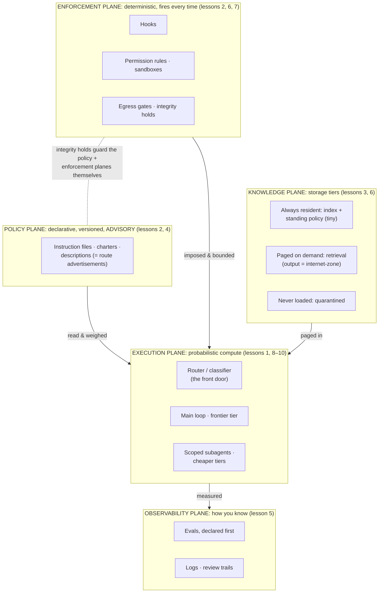
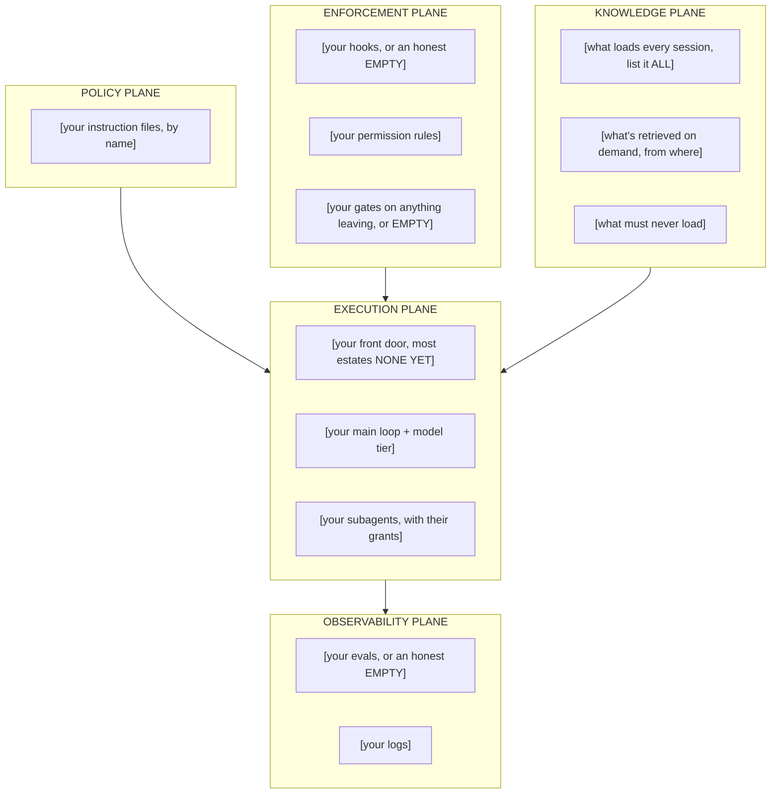

# The estate map: the module's tiered artifacts

*Agentics field guide, module-framing artifacts. Distinct from the per-lesson
diagrams: these frame the whole module. L1 is the one truth; L2 is drawn from YOUR estate, never
copied; L3 is the bridge you say aloud.*

## L1. The one truth: every agentic estate is five planes

If you keep a single drawing from this guide, keep this one. Every lesson lives somewhere on it.

Three reading rules make it the *one truth*:

1. **The planes are load-bearing, not decorative.** Anything that must always happen lives in
   enforcement; anything the model reads lives in policy; anything fetched enters through
   knowledge with a zone tag. If you can't place a component on one plane, you don't yet
   understand the component.
2. **The arrows are the security model.** Policy is *read*; enforcement is *imposed*; knowledge
   is *paged*; everything is *measured*. The dashed arrow is lesson 7 in one stroke: the
   enforcement plane guards the very files the other planes are made of.
3. **The front door is drawn even if you haven't built it.** Most estates start with no
   classifier, so every request goes straight onto the big iron. Draw the router anyway, greyed if
   honest: the empty seat is the finding.

## L2. Your estate, drawn as this datacenter (draw it yourself; that's the artifact)

An L2 someone hands you is a generic picture; an L2 you draw is a design document. Copy the
skeleton and replace every bracket with what is *actually true* of your deployment today, not
what you plan, what's running:

**The rules of the exercise** (this is where the value is):

- **Every bracket gets filled or marked EMPTY, in writing.** An EMPTY on the enforcement or
  observability plane is not a formatting problem; it's a finding. The drawing's job is to make
  absences as visible as presences.
- **Draw what runs, not what you intend.** If your "review gate" is a sentence in an instruction
  file, it goes on the *policy* plane, and putting it in enforcement would be exactly the
  plane-confusion lesson 2 warned about. Where a control sits on this drawing is a factual
  claim.
- **Expect three to five findings.** Typical harvest from a first honest L2: no front door (all
  traffic on the frontier tier), no gate on one whole class of outbound action, an always-resident
  set that hasn't been audited since it accreted, retrieval output entering untagged, and zero
  evals. Each finding maps to a lesson and to a design-brief section (lesson 11), so your L2 *is*
  the gap analysis that seeds the brief.
- **Date it and keep it.** Redraw quarterly or after any structural change. The diff between two
  L2s is your estate's change history at the architecture level, the as-designed staying ahead
  of the cables, per the capstone's bite.

## L3. The bridge, said aloud

The one-minute narrative that fuses the old career and the new estate. Say it to a colleague,
a hiring panel, or a mirror, until it comes out in your own words:

> "I spent my career running estates: fleets of components I didn't write, made reliable with
> policy, routing, trust boundaries, capacity plans, and monitoring. An agentic deployment is the
> same estate in a new material, with one changed law of physics: the components only *mostly*
> comply. Everything I do differently follows from that one law. Policy and enforcement split
> into separate planes, because prose can't guarantee anything anymore. Memory management became
> attention management, because loaded-but-irrelevant now degrades instead of idling. Routing
> became classify-then-forward, because the traffic stopped carrying destinations, and misroutes
> went silent, so the default route flipped from 'deliver anyway' to 'stop and escalate.'
> Segmentation went behavioral, because data and control share one channel now, and a hostile
> document is an insider. And monitoring became evals-first, because failure stopped announcing
> itself. The job didn't change: make the whole reliable. I already know the job. I learned the
> material."

That's the module, compressed to a minute. If any sentence in it feels like recitation rather
than something you could defend under questioning, the sentence names the lesson to reread. It
was built one clause per lesson, on purpose.

---

*Done-tests: L1 stands alone, so a reader who sees only that diagram gets the
five planes, the security model, and the front-door finding. L2 is drawn from the learner's
reality, and the skeleton enforces it by being useless until filled. L3 compresses the module into
sixty seconds of the learner's own voice.*
